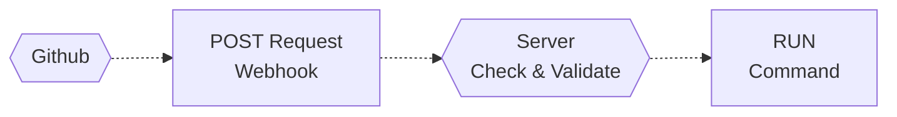

# Webhook Deployer

## Introduction

A simple deployer from github webhook to a unique server.

It's a [Laravel](https://laravel.com/) application using [Spatie webhook client](https://github.com/spatie/laravel-webhook-client) and [IPLib](https://github.com/mlocati/ip-lib)

## Principe

* Github webhook send a *POST request* to your `Webhook Deployer` project
* `Webhook Deployer` check and validate the request
* Then it run a *command* on the server *(ex : a bash script to update a website)*

There is 3 validation :
* IP White list (from [Meta Github API](https://api.github.com/meta))
* Key validation *(A key must be defined in your webhook call, and it's check by app)*
* Find project in a config file *(if not find, it will fail)*

## Install

Clone the project on your server
```bash
git clone https://github.com/sylfel/webhook-deployer.git
```
Run composer
```bash
composer install --no-dev --no-interaction --prefer-dist --optimize-autoloader
```
Init `.env` & `deploy.json` config file
```bash
cp .env.example .env
touch storage/app/deploy.json
```

Run database migration
```bash
php artisan migrate --force
```

Define laravel app key & run optimisation
```sh
php artisan key:generate --force
php artisan clear-compiled
php artisan optimize
```

Define a cron to run laravel Scheduler every minute
```
* * * * * [PHP_PATH] [APP_PATH]/webhook-deployer/artisan schedule:run > /dev/null 2>&1
```
Where `PHP_PATH` is absolute path to php *( ex : `/usr/local/bin/php`)*
and `APP_PATH` is path to installed application

Define an public url to the `/public` directory


## Config
* Change `APP_URL` in `.env` file
* Define a `WEBHOOK_CLIENT_SECRET` signing_secret in `.env` file

* Define projects in `deploy.json`
```json
[
    {
        "repository": "webhook-deployer", // repository name
        "path":"/path/to/project/webhook-deployer", // path from where to run command
        "command":"bash -lc .script/deploy.sh" // command to run
    },
    {
        ...
    }
]
```
* Define a webhook in github with same key as `WEBHOOK_CLIENT_SECRET`